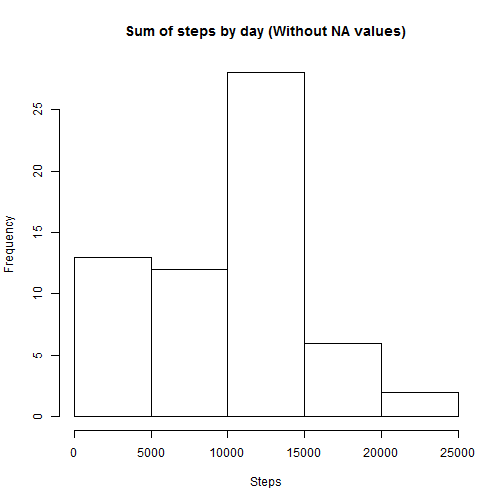
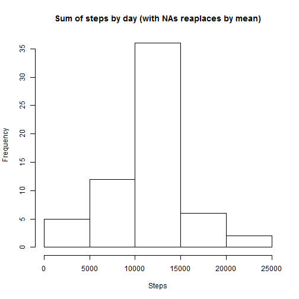
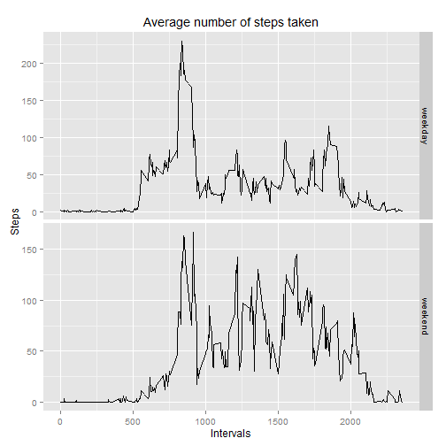

Peer Assessment 1 of Reproducible Research course on Coursera
by M. Sabelnikov


## Loading and preprocessing the data
Loading packages adn setting time settings

```r
library(dplyr)
library(data.table)
library(ggplot2)
Sys.setlocale("LC_TIME", "USA")
```
Reading data from CSV in working directory:

```r
data<-read.csv("activity.csv")
```

Checking the structure of the data:


```r
str(data)
```

```
## 'data.frame':	17568 obs. of  3 variables:
##  $ steps   : int  NA NA NA NA NA NA NA NA NA NA ...
##  $ date    : Factor w/ 61 levels "2012-10-01","2012-10-02",..: 1 1 1 1 1 1 1 1 1 1 ...
##  $ interval: int  0 5 10 15 20 25 30 35 40 45 ...
```
## What is mean total number of steps taken per day?

Calculating mean, sum and median by day

```r
mean_steps<-data %>% group_by(date) %>% summarize(steps=mean(steps,na.rm=T))
sum_steps<-data %>% group_by(date) %>% summarize(steps=sum(steps,na.rm=T))
median_steps<-data %>% group_by(date) %>% summarize(steps=median(steps,na.rm=T))
```
Make a histogram of the total number of steps taken each day

```r
hist(sum_steps$steps,main="Sum of steps by day (Without NA values)",xlab="Steps")
```

 

Mean and meadian steps by day table

```r
mean_steps<-data.table(mean_steps)
mean_steps<-cbind(mean_steps,median_steps$steps)
setnames(mean_steps,c("date","mean","median"))
mean_steps
```

```
##           date       mean median
##  1: 2012-10-01         NA     NA
##  2: 2012-10-02  0.4375000      0
##  3: 2012-10-03 39.4166667      0
##  4: 2012-10-04 42.0694444      0
##  5: 2012-10-05 46.1597222      0
##  6: 2012-10-06 53.5416667      0
##  7: 2012-10-07 38.2465278      0
##  8: 2012-10-08        NaN     NA
##  9: 2012-10-09 44.4826389      0
## 10: 2012-10-10 34.3750000      0
## 11: 2012-10-11 35.7777778      0
## 12: 2012-10-12 60.3541667      0
## 13: 2012-10-13 43.1458333      0
## 14: 2012-10-14 52.4236111      0
## 15: 2012-10-15 35.2048611      0
## 16: 2012-10-16 52.3750000      0
## 17: 2012-10-17 46.7083333      0
## 18: 2012-10-18 34.9166667      0
## 19: 2012-10-19 41.0729167      0
## 20: 2012-10-20 36.0937500      0
## 21: 2012-10-21 30.6284722      0
## 22: 2012-10-22 46.7361111      0
## 23: 2012-10-23 30.9652778      0
## 24: 2012-10-24 29.0104167      0
## 25: 2012-10-25  8.6527778      0
## 26: 2012-10-26 23.5347222      0
## 27: 2012-10-27 35.1354167      0
## 28: 2012-10-28 39.7847222      0
## 29: 2012-10-29 17.4236111      0
## 30: 2012-10-30 34.0937500      0
## 31: 2012-10-31 53.5208333      0
## 32: 2012-11-01        NaN     NA
## 33: 2012-11-02 36.8055556      0
## 34: 2012-11-03 36.7048611      0
## 35: 2012-11-04        NaN     NA
## 36: 2012-11-05 36.2465278      0
## 37: 2012-11-06 28.9375000      0
## 38: 2012-11-07 44.7326389      0
## 39: 2012-11-08 11.1770833      0
## 40: 2012-11-09        NaN     NA
## 41: 2012-11-10        NaN     NA
## 42: 2012-11-11 43.7777778      0
## 43: 2012-11-12 37.3784722      0
## 44: 2012-11-13 25.4722222      0
## 45: 2012-11-14        NaN     NA
## 46: 2012-11-15  0.1423611      0
## 47: 2012-11-16 18.8923611      0
## 48: 2012-11-17 49.7881944      0
## 49: 2012-11-18 52.4652778      0
## 50: 2012-11-19 30.6979167      0
## 51: 2012-11-20 15.5277778      0
## 52: 2012-11-21 44.3993056      0
## 53: 2012-11-22 70.9270833      0
## 54: 2012-11-23 73.5902778      0
## 55: 2012-11-24 50.2708333      0
## 56: 2012-11-25 41.0902778      0
## 57: 2012-11-26 38.7569444      0
## 58: 2012-11-27 47.3819444      0
## 59: 2012-11-28 35.3576389      0
## 60: 2012-11-29 24.4687500      0
## 61: 2012-11-30        NaN     NA
##           date       mean median
```

Mean number of steps is **37.3825996**  
Median number of steps is **0**

## What is the average daily activity pattern?
Make a time series plot (i.e. type = "l") of the 5-minute interval (x-axis) and the average number of steps taken, averaged across all days (y-axis)

Cleaning data

```r
data_clean1<-complete.cases(data$steps)
data_clean<-data[data_clean1,]
```

Calculating summary table and plotting

```r
interval<-group_by(data_clean,interval)
int<-summarize(interval,steps=mean(steps))
plot(int$interval,int$steps,type="l",xlab="Interval",ylab="Steps")
```

 

Which 5-minute interval, on average across all the days in the dataset, contains the maximum number of steps?

```r
m<-int[int$steps==max(int$steps),1]
```

The interval with maximum number of steps is interval # **835**

## Imputing missing values
Calculate and report the total number of missing values in the dataset (i.e. the total number of rows with NAs)

```r
nas<-table(data_clean1)
```
The total number of missing values in the dataset is **2304**

Filling in all of the missing values in the dataset


```r
data_wo_nas <-merge(data,int,by="interval")

id<-1:17568
for (i in id){
        if (is.na(data_wo_nas[i,2])){
                data_wo_nas[i,2]<-data_wo_nas[i,4]}
        else {}
        
}
```

Create a new dataset that is equal to the original dataset but with the missing data filled in.

```r
data_new<-select(data_wo_nas,steps=steps.x,interval,date)
```

Make a histogram of the total number of steps taken each day

```r
sum_steps_new<-data_new %>% group_by(date) %>% summarize(steps=sum(steps,na.rm=T))
hist(sum_steps_new$steps,main="Sum of steps by day (with NAs reaplaces by mean)",xlab="Steps")
```

 
  
**Here is initial histogram**

```r
hist(sum_steps$steps,main="Sum of steps by day (Without NA values)",xlab="Steps")
```

 

Mean number of steps in data with NAs replaced is **37.3825996**  
Median number of steps in data with NAs replaced is **0**  

As we can see total mean didn't change from the estimation of the 1st part of assignment.

## Are there differences in activity patterns between weekdays and weekends?

Adding column with weekdays

```r
data_new$weekday<-weekdays(as.Date(data_new$date))
data_new$weekday<-ifelse(data_new$weekday %in% c("Saturday", "Sunday"),"weekend", "weekday")
```

Calculate averages and plot.

```r
data_new2<-data_new %>% group_by(interval,weekday) %>% summarize(steps=mean(steps,na.rm=T))
ggplot(data_new2, aes(x=interval, y=steps, fill=weekday)) +
        geom_line(stat="identity") + 
        facet_grid(weekday  ~ ., scales="free") +
        ylab("Steps") + 
        xlab("Intervals") +
        ggtitle(expression("Average number of steps taken"))
```

 
